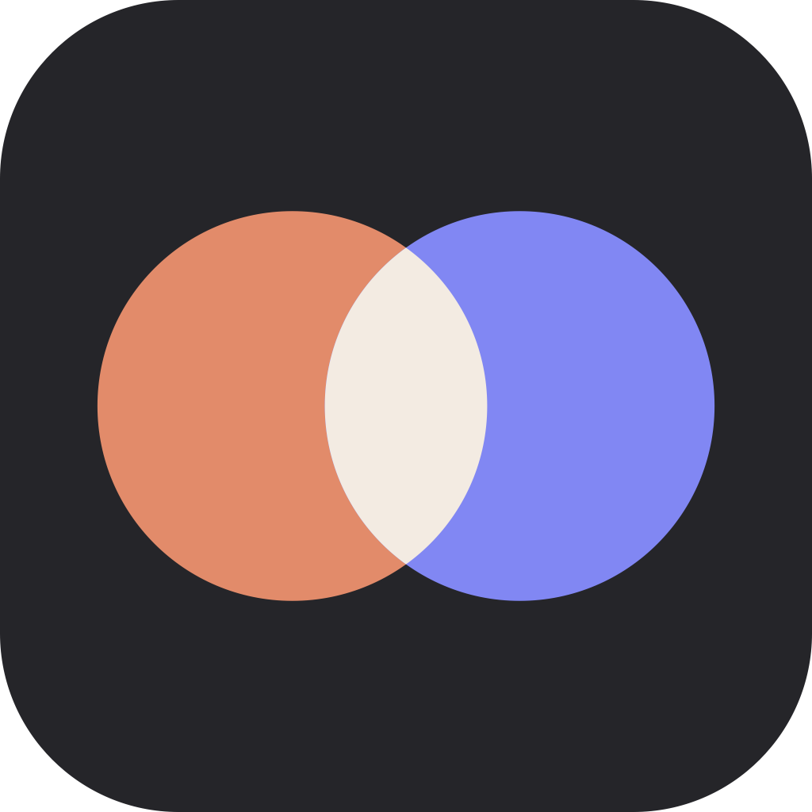

# Burn

A Mac menu bar app that shows how much of your Claude and ChatGPT Codex usage you have left, without opening anything.

This repository holds the downloads only. Burn's source code is private.

**[Download the latest version](../../releases/latest)**

## What It Does

Burn keeps a live reading in your menu bar. The default is a compact one, showing each tool's five hour usage either side of a thin divider:

```
◐ 13 | 27
```

The numbers are pace aware, which is the part that makes them worth glancing at. They stay calm while you are comfortably inside your window and warm toward red as you start burning faster than the time left allows, so 80 percent with half an hour to go reads very differently from 80 percent with four hours to go. Two roomier layouts are a click away in Settings if you would rather see your longer window and a countdown alongside.

Click the menu bar to open the full panel. There is a card for each tool's current five hour session showing where you stand and how long is left, then meters for your longer budgets with the time until each one resets.

Burn also installs a desktop widget, and can send you a notification when you cross a usage level or start running hot. Both are optional.

## Requirements

- macOS 13 Ventura or later
- An Apple Silicon Mac. This build will not run on an Intel Mac.
- The `claude` or `codex` command line tool installed and signed in. Burn reads the sign in they have already saved, so it never asks you for a password.

## Installing

The first install has to be done by hand. Every update after that installs itself.

1. Download the zip from the [latest release](../../releases/latest) and double click it to unzip.
2. Drag **Burn** into your Applications folder.
3. Open it. macOS will refuse the first time and say it cannot verify the developer. That is expected, because Burn is a personal app rather than something from the App Store.
4. Open System Settings, go to Privacy and Security, scroll to the bottom, and press **Open Anyway**. Confirm, and Burn will start.
5. The first time it reads your sign in, macOS asks for permission. Choose **Always Allow** so it stops asking.

Burn has no window of its own. It lives in the menu bar, and everything including Settings is in the dropdown.

## Updating

Burn checks this repository once a day on its own. When a newer version is here it downloads it, confirms it was signed by the same developer certificate as the copy you are already running, replaces itself, and shows you what changed the next time it starts. There is nothing for you to do.

## Privacy

Burn talks to Anthropic and OpenAI and nowhere else, and only to ask for your own usage figures using the sign in your command line tools already saved on this Mac. Nothing is sent anywhere else, there is no analytics, and there is no account to create.

The figures it gets back are kept in a plain text file on your Mac at `~/Library/Application Support/Burn/state.json`, which you are welcome to read from your own scripts. It stays current while Burn is running.

## Source Code

Kept private on purpose. This repository exists so that Burn has somewhere public to fetch its updates from, without anything else being exposed.
