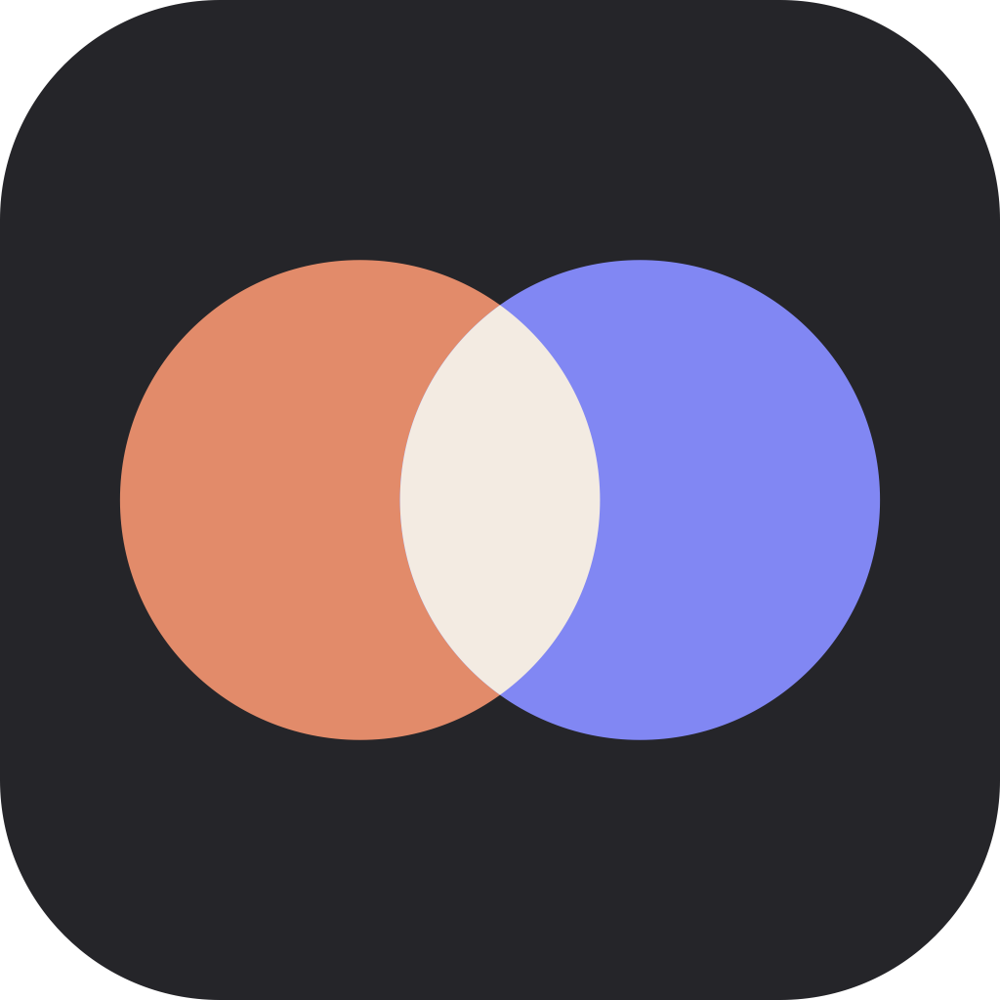

# Burn

A Mac menu bar app that shows your Claude and ChatGPT Codex usage at a glance. Notion AI support is paused for now and does not appear in the app.

This repository holds the downloads only. Burn's source code is private.

**[Download the latest version](../../releases/latest)**

## What It Does

Burn keeps a live reading in your menu bar. Choose Inline for one row or Stacked for two rows, then pick the tools, usage windows and countdowns you want to see, and the colour each tool wears. You can use different settings on the laptop screen and an external monitor.

The numbers are pace aware. They stay calm while you are comfortably inside your window and warm toward red as you start burning faster than the time left allows, so 80 percent with half an hour to go reads very differently from 80 percent with four hours to go.

Click the menu bar to open the full panel, called Runway. Every usage window is drawn as a track running from when the window opened to when it resets, with a marker for where you are now, so being ahead of or behind pace reads as a shape rather than a sentence. Codex comes first, then Claude. Each window shows how much you have used, its countdown and its pace line, and Claude's Fable 5 allowance gets a row of its own. A bar stays in the tool's colour while you are on or under pace and turns yellow, amber, orange or red once you are over, and if a window is on course to run out before it resets, a line under it says for how long, for example "dry for 1d 7h". Banked resets show with a countdown to when each one expires. Under each tool sits its Models Mix, a breakdown of which models it has been using in the current cycle, worked out from the coding sessions recorded on this Mac.

Three sections sit below: This Cycle follows your usage through the current window and shows where it is expected to land at reset, Last 7 Days is a calendar of coloured tiles, and Today shows your day in numbers: the new tokens you have used, how many sessions you started, how long you were active, your busiest hour, and how today compares with a usual day by this time.

The Analytics button at the bottom of the panel opens the Burn window, with Overview, Projects, Models, Activity and History pages. History keeps a permanent summary of your usage on this Mac: the all-time total, month by month, your biggest day, your longest streak and how each weekly cycle ended. Token counts there are the new tokens your work used, with cache reads shown on their own line. Burn keeps token counts, model names, project folder names and session times, and never anything you type or read.

Plan badges follow your current subscription: Pro, Max 5x or Max 20x for Claude, and Plus, Pro 5x or Pro 20x for Codex. The small macOS widget shows the full plan too.

Burn includes an optional small widget in the macOS widget gallery. It can also send notifications when you cross a usage level or start running hot.

## Requirements

- macOS 26 or later
- An Apple Silicon Mac. This build will not run on an Intel Mac.
- The `claude` or `codex` command line tool installed and signed in. Burn reads the sign in they have already saved, so it never asks you for a password.

## Installing

The first install has to be done by hand. Every update after that installs itself.

1. Download the zip from the [latest release](../../releases/latest) and double click it to unzip.
2. Drag **Burn** into your Applications folder.
3. Open it. macOS will refuse the first time and say it cannot verify the developer. That is expected, because Burn is a personal app rather than something from the App Store.
4. Open System Settings, go to Privacy and Security, scroll to the bottom, and press **Open Anyway**. Confirm, and Burn will start.
5. The first time it reads your sign in, macOS asks for permission. Choose **Always Allow** so it stops asking.

Burn lives in the menu bar. Click it, then the Settings button at the bottom of the panel, or press ⌘, to change what it shows.

## Updating

Burn checks this repository once a day on its own. When a newer version is here it downloads it, verifies the app and its developer signature, replaces itself, and shows you what changed after relaunching. You can also check by hand from Burn's Settings.

## Privacy

Burn contacts Anthropic and OpenAI to read your usage and current plan using the sign-in already saved on this Mac. While Notion AI support is paused, Burn reads nothing from Notion. Burn also contacts GitHub to check for and download app updates. There is no analytics and no separate Burn account to create.

The figures it gets back are kept in a plain text file on your Mac at `~/Library/Application Support/Burn/state.json`, which you are welcome to read from your own scripts. It stays current while Burn is running. Your usage history for the Analytics window is kept in a local database in the same folder and never leaves your Mac.

## Source Code

Kept private on purpose. This repository exists so that Burn has somewhere public to fetch its updates from, without anything else being exposed.
